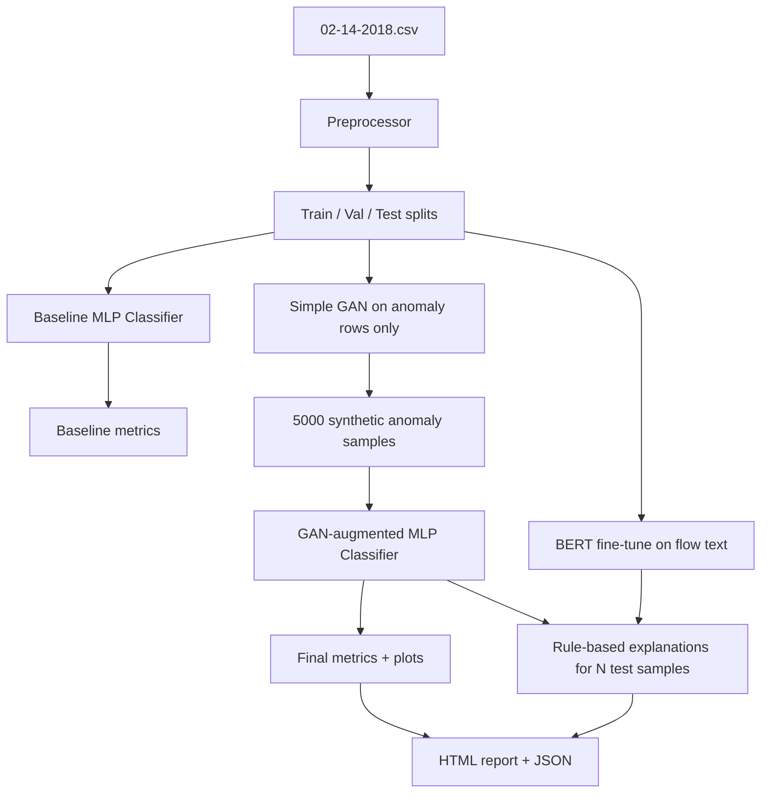

# Project Overview

## What this project does

This is an **IoT network anomaly detection** system. It reads network flow records (from the CIC-IDS-2018 dataset), learns to classify each flow as **Benign** or **Anomaly** (attack), and generates a **report with metrics, charts, and text explanations**.

The README title says **"GAN + BERT Hybrid"** because it combines:

1. **GAN** — generates synthetic anomaly samples to balance training data  
2. **MLP Classifier** — predicts benign vs anomaly from numeric features  
3. **BERT** — fine-tuned on text descriptions of flows; used for explainability narrative (explanations are built from rules + flow text, with BERT trained in parallel)

---

## Problem being solved

IoT devices generate huge amounts of network traffic. Attacks such as **FTP brute-force** and **SSH brute-force** look similar to normal traffic in raw numbers, but patterns differ (packet rates, flags, durations, etc.).

Challenges this pipeline addresses:

| Challenge | How the project handles it |
|-----------|----------------------------|
| Class imbalance (more benign than attack) | GAN generates 5,000 extra synthetic anomaly rows |
| High-dimensional tabular features (~78 columns) | MLP with BatchNorm, dropout, residual block |
| Hard-to-interpret ML predictions | Converts features to English text + structured explanation blocks |
| Need for evaluation | Accuracy, precision, recall, F1, ROC-AUC, PR-AUC, confusion matrix, comparison table |

---

## High-level architecture



---

## Is it CT-GAN or a simple GAN?

**Simple (vanilla) GAN — not CT-GAN / CTGAN.**

| Aspect | This project | CT-GAN / CTGAN (tabular) |
|--------|-------------|-------------------------|
| Architecture | MLP Generator + MLP Discriminator | VAE + GAN, conditional vectors, mode-specific normalization |
| Input | Only anomaly feature vectors | Full table with mixed categorical + continuous |
| Conditioning | Trains only on `y == 1` rows (implicit) | Explicit condition on discrete columns |
| Loss | Binary cross-entropy (BCE) | Wasserstein + auxiliary losses, etc. |
| Purpose here | Augment minority class | Generate realistic synthetic tabular datasets |

See [04-GAN.md](04-GAN.md) for full GAN details.

---

## Project folder structure

```text
ANOMOLY_DETECTION_FOR_IOT/
├── 02-14-2018.csv          # Raw CIC-IDS-2018 IoT traffic (1M+ rows)
├── config.py               # All hyperparameters and paths
├── main.py                 # Orchestrates the full pipeline
├── requirements.txt        # Python dependencies
├── data/
│   └── processed/          # Scaler, numpy arrays, feature names (after preprocess)
├── logs/                   # Timestamped run logs
├── results/
│   ├── models/             # classifier.pt, generator.pt, discriminator.pt, bert_explainer/
│   ├── plots/              # PNG charts
│   └── reports/            # explanation_report.html, results.json
├── src/
│   ├── data_processing/    # preprocessor.py
│   ├── models/             # gan.py, classifier.py
│   ├── training/           # train_gan.py, train_classifier.py
│   ├── explainability/     # bert_explainer.py
│   └── evaluation/         # metrics.py, visualizer.py
└── docs/                   # This documentation
```

---

## Pipeline stages (execution order)

| Step | File(s) | Output |
|------|---------|--------|
| 1. Load & preprocess | `preprocessor.py` | Scaled `X_train`, `X_val`, `X_test`, labels |
| 2. Baseline classifier | `classifier.py`, `train_classifier.py` | Metrics with `base_` prefix |
| 3. Train GAN | `gan.py`, `train_gan.py` | `synth_X` (5000 rows), loss plots |
| 4. GAN-augmented classifier | `train_classifier.py` | `classifier.pt`, training curves |
| 5. Evaluate | `metrics.py`, `visualizer.py` | Confusion matrix, ROC/PR, heatmaps |
| 6. BERT fine-tune | `bert_explainer.py` | Saved under `results/models/bert_explainer/` |
| 7. Explanations + report | `bert_explainer.py`, `visualizer.py` | HTML + JSON |

Detailed step-by-step: [09-MAIN-PIPELINE.md](09-MAIN-PIPELINE.md).

---

## Classes and labels

Original dataset labels used in this project:

| Original label | Binary label | Meaning |
|----------------|--------------|---------|
| `Benign` | 0 | Normal IoT traffic |
| `FTP-BruteForce` | 1 | Attack |
| `SSH-Bruteforce` | 1 | Attack |

Other labels in the CSV (if any) are **dropped** — only rows in `LABEL_MAP` are kept.

---

## Key technologies

- **Python 3** — runtime  
- **PyTorch** — GAN, MLP classifier, BERT training loop  
- **scikit-learn** — split, scale, metrics  
- **pandas / numpy** — data handling  
- **Hugging Face Transformers** — `bert-base-uncased`  
- **matplotlib / seaborn** — plots  
- **joblib** — save/load scaler  

---

## Expected runtime (rough)

On **CPU** with default `config.py`:

| Stage | Approximate time |
|-------|------------------|
| Preprocessing | 10–20 seconds |
| Baseline classifier | 1–3 minutes (early stop ~epoch 8) |
| GAN (200 epochs, ~51k anomaly rows) | **25–40 minutes** |
| Final classifier (30 epochs max) | 5–15 minutes |
| BERT fine-tune (3 epochs, 1000 samples) | 15–45+ minutes |
| Plots + report | 1–2 minutes |

**Total: often 1–2 hours on CPU.** GPU reduces GAN and classifier time significantly.

---

## Next documents

- Setup: [02-SETUP-AND-USAGE.md](02-SETUP-AND-USAGE.md)  
- Data: [03-DATA-AND-PREPROCESSING.md](03-DATA-AND-PREPROCESSING.md)  
- GAN: [04-GAN.md](04-GAN.md)  
