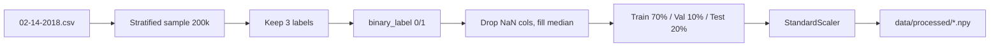

# Data and Preprocessing

**Source file:** `src/data_processing/preprocessor.py`  
**Entry function:** `load_and_preprocess(config)`

---

## Dataset: CIC-IDS-2018 (`02-14-2018.csv`)

- **Source:** Canadian Institute for Cybersecurity Intrusion Detection Dataset 2018  
- **Rows:** ~1,048,575 network flows  
- **Columns:** 80 (79 features + `Label`)  
- **Content:** IoT / network traffic statistics per flow (ports, packet counts, flags, durations, rates, etc.)

### Example feature columns

| Column | Meaning |
|--------|---------|
| `Dst Port` | Destination port |
| `Protocol` | Protocol type |
| `Flow Duration` | Length of flow in time |
| `Tot Fwd Pkts` / `Tot Bwd Pkts` | Forward/backward packet counts |
| `Flow Byts/s`, `Flow Pkts/s` | Byte and packet rates |
| `SYN Flag Cnt`, `ACK Flag Cnt`, … | TCP flag statistics |
| `Label` | Attack type or `Benign` |

`Timestamp` is read but **not used as a model feature** (dropped before training).

---

## Label mapping

Defined in `config.py` as `LABEL_MAP`:

```python
LABEL_MAP = {
    "Benign":           0,
    "FTP-BruteForce":   1,
    "SSH-Bruteforce":   1,
}
```

| Step | Column | Description |
|------|--------|-------------|
| Filter | — | Keep only rows whose `Label` is in `LABEL_MAP` |
| Binary | `binary_label` | 0 = benign, 1 = any attack |
| Detail | `attack_type` | Original string label (for explanations) |

---

## Stratified sampling

If `SAMPLE_SIZE` (default **200,000**) is less than total rows:

- For **each label group**, sample a proportional fraction  
- Preserves class ratios while reducing memory and training time  
- Uses `random_state=42` for reproducibility  

Example log output:

```text
Raw shape: (1048575, 80)
After stratified sampling: (199998, 80)
```

---

## Feature cleaning

1. **Drop label columns** from feature matrix: `Label`, `binary_label`, `attack_type`, `Timestamp`  
2. **Replace infinities** with `NaN`  
3. **Drop sparse columns:** any column with more than 50% missing values  
4. **Impute remaining NaN** with column **median**  
5. Result: typically **~78 numeric features**  

Feature names saved to:

```text
data/processed/feature_names.csv
```

---

## Train / validation / test split

| Set | Fraction | Typical size (200k sample) |
|-----|----------|----------------------------|
| Test | `TEST_SIZE` = 20% | ~40,000 |
| Val | `VAL_SIZE` = 10% of original (10% of remaining 80%) | ~20,000 |
| Train | Remainder | ~140,000 |

- **Stratified** on `binary_label` so each split has similar benign/attack ratio  
- Attack type strings for test set saved as `att_test.npy` (used only in explanations)

---

## Scaling

**`StandardScaler`** from scikit-learn:

- Fit **only on training data**  
- Transform train, val, and test  
- Formula per feature: `(x - mean) / std`  

Scaler persisted:

```text
data/processed/scaler.pkl
```

All feature arrays saved as float32 `.npy` files:

```text
data/processed/X_train.npy
data/processed/X_val.npy
data/processed/X_test.npy
data/processed/y_train.npy
data/processed/y_val.npy
data/processed/y_test.npy
data/processed/att_test.npy
```

---

## Reload preprocessed data

Function `load_preprocessed(config)` loads the saved files without re-reading the CSV — useful if you add a separate inference script later.

---

## Return dictionary from `load_and_preprocess`

| Key | Type | Use |
|-----|------|-----|
| `X_train`, `X_val`, `X_test` | `np.ndarray` float32 | Model inputs |
| `y_train`, `y_val`, `y_test` | `np.ndarray` int | 0/1 labels |
| `att_test` | `np.ndarray` str | Attack name per test row |
| `scaler` | `StandardScaler` | Inverse transform if needed |
| `feature_names` | `list[str]` | For BERT text and explanations |
| `n_features` | `int` | Input dimension for GAN and MLP |

---

## Data flow diagram



---

## Why scaling matters for GAN and MLP

- GAN generator ends with **Tanh** → outputs in [-1, 1]  
- Real data after `StandardScaler` is roughly centered around 0 with unit variance — compatible with Tanh  
- Without scaling, training would be unstable and losses would be huge  

See [04-GAN.md](04-GAN.md) and [05-CLASSIFIER.md](05-CLASSIFIER.md).
