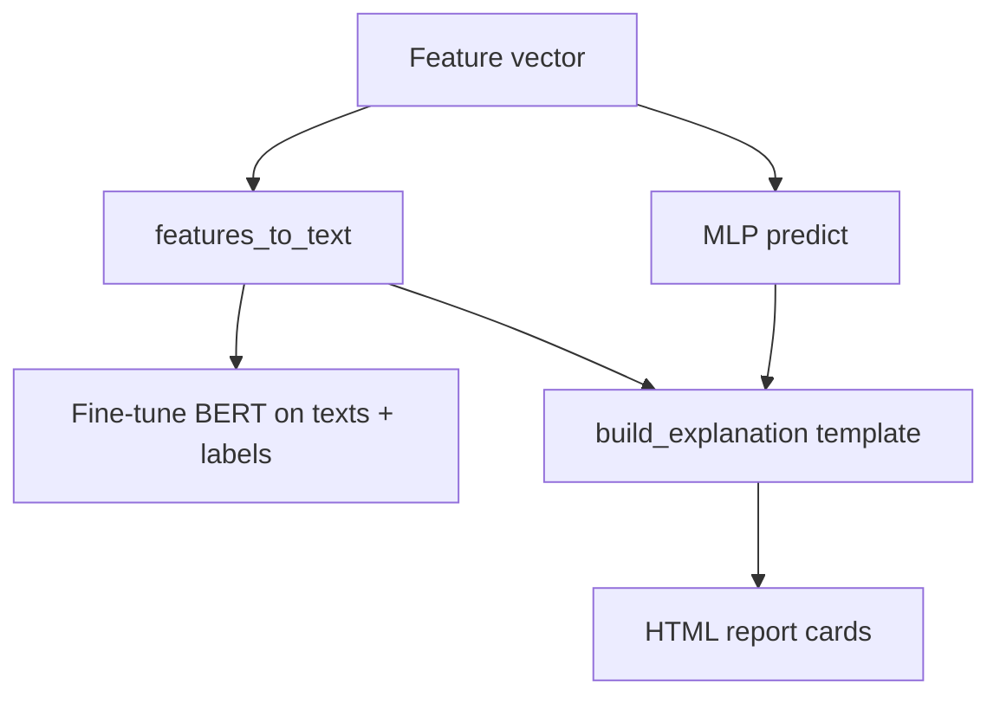

# BERT Explainability

**Source file:** `src/explainability/bert_explainer.py`

---

## Purpose

Security analysts need to understand **why** a flow was flagged. This module:

1. Converts numeric flow features into **English sentences**  
2. **Fine-tunes** `bert-base-uncased` for binary classification on those sentences  
3. Builds **structured text explanations** for sample test predictions (used in the HTML report)

> **Important:** The explanations shown in the HTML report are primarily generated by **`build_explanation()`** (rule-based templates). BERT is fine-tuned in parallel and saved, but the report text does not call BERT inference per sample — it uses MLP predictions + feature-derived text.

---

## Step 1: Features → text (`features_to_text`)

For each flow vector:

1. Rank features by **absolute value** (top 10 most “active”)  
2. Format each feature with simple rules:

| Feature name pattern | Text template |
|--------------------|---------------|
| contains `pkt` or `bytes` | `"X is high/low (value)"` |
| contains `flag` | `"X count is N"` |
| contains `duration` | `"flow duration is long/short"` |
| contains `rate` or `pkts/s` | `"traffic rate is elevated/normal"` |
| else | `"X = value"` |

**Example output:**

```text
Network flow: Flow Pkts/s is high (1.24); SYN Flag Cnt count is 2.0; Flow Duration is long; ...
```

Scaled features are used (positive/negative relative to mean), so “high” means `val > 0.5` after scaling.

---

## Step 2: BERT model (`BertAnomalyExplainer`)

### Loaded components

- **`BertTokenizer`** — `bert-base-uncased`  
- **`BertForSequenceClassification`** — 2 labels (Benign=0, Anomaly=1)

### Fine-tuning data (from `main.py`)

| Set | Size | Source |
|-----|------|--------|
| Train | 1000 | First 1000 rows of `X_train`, `y_train` |
| Val | 200 | First 200 rows of `X_val`, `y_val` |

Subset keeps BERT training time manageable on CPU.

### Training loop

| Setting | Default |
|---------|---------|
| `BERT_EPOCHS` | 3 |
| `BERT_BATCH_SIZE` | 16 |
| `BERT_LR` | 2e-5 |
| `BERT_MAX_LEN` | 128 tokens |
| Optimizer | AdamW |
| Scheduler | LinearLR decay over total steps |
| Gradient clip | 1.0 |

Best validation accuracy checkpoint saved to:

```text
results/models/bert_explainer/
```

---

## Step 3: Generate explanations (`generate_explanations`)

- Randomly picks `NUM_EXPLAIN_SAMPLES` (default **10**) test indices  
- For each: calls `build_explanation()` with:
  - MLP `y_pred` and `y_proba`  
  - Feature vector and names  
  - Original attack type string from `att_test`

### Explanation template structure

```text
[PREDICTION]: ANOMALY (Attack) | Confidence: 87.3%
[FLOW DESCRIPTION]: Network flow: ...
[REASON]: This network flow exhibits elevated packet rates...
[ATTACK TYPE]: SSH-Bruteforce
[RECOMMENDATION]: Block the source IP...
```

For benign predictions, reason and recommendation describe normal monitoring.

---

## Class `FlowTextDataset`

PyTorch `Dataset` that tokenizes each text:

- `padding="max_length"`  
- `truncation=True`  
- `max_length=BERT_MAX_LEN`  
- Returns `input_ids`, `attention_mask`, `labels`

---

## BERT vs “LLM explanations” marketing

The README mentions “LLM-based explanations.” In code:

| Component | Actually does |
|-----------|----------------|
| BERT fine-tune | Learns to classify flow **text** as benign/anomaly |
| `build_explanation` | Template strings + feature text — **no BERT forward pass** at explain time |

To use BERT for explanation generation, you would add inference that summarizes attention or uses generated text — **not implemented in current code**.

---

## Why BERT stage is slow

- Downloads ~440 MB model first run  
- Transformer on CPU: ~16 samples/batch, 3 epochs × 1000 samples  
- Often **15–45 minutes** after GAN + classifier complete  

---

## Configuration

| Variable | Default |
|----------|---------|
| `BERT_MODEL` | `bert-base-uncased` |
| `BERT_MAX_LEN` | 128 |
| `BERT_BATCH_SIZE` | 16 |
| `BERT_EPOCHS` | 3 |
| `BERT_LR` | 2e-5 |
| `NUM_EXPLAIN_SAMPLES` | 10 |

---

## Code flow



See [07-EVALUATION-AND-REPORTS.md](07-EVALUATION-AND-REPORTS.md) for report format.
