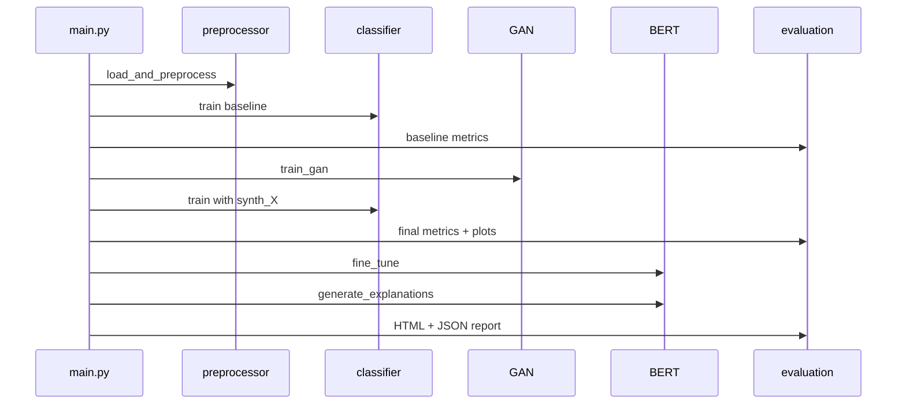

# Main Pipeline (`main.py`)

**File:** `main.py` — single entry point for the entire project.

---

## Imports and setup

```python
import config
from src.data_processing.preprocessor import load_and_preprocess
from src.models.gan import build_gan
from src.models.classifier import build_classifier
from src.training.train_gan import train_gan
from src.training.train_classifier import train_classifier, predict, predict_proba
from src.explainability.bert_explainer import BertAnomalyExplainer
from src.evaluation.metrics import compute_metrics, build_comparison_table
from src.evaluation.visualizer import ...
```

Logging:

- File: `logs/run_YYYYMMDD_HHMMSS.log`  
- Console: same format  
- Level: `INFO`

---

## `main()` — line by line

### 1. Device selection

```python
device = torch.device("cuda" if torch.cuda.is_available() else "cpu")
```

Logs CPU or CUDA.

---

### 2. Load and preprocess data

```python
data = load_and_preprocess(config)
```

Returns dict with `X_train`, `X_val`, `X_test`, labels, `att_test`, `feature_names`, `n_features`.

See [03-DATA-AND-PREPROCESSING.md](03-DATA-AND-PREPROCESSING.md).

---

### 3. Baseline classifier (no GAN)

```python
baseline_model = build_classifier(config, data["n_features"], device)
_ = train_classifier(..., synth_X=np.empty((0, n_features)), ...)
y_pred_base = predict(baseline_model, data["X_test"], device)
y_prob_base = predict_proba(baseline_model, data["X_test"], device)
baseline_metrics = compute_metrics(..., prefix="base_")
```

**Purpose:** Benchmark before synthetic augmentation.

---

### 4. Train GAN

```python
G, D = build_gan(config, data["n_features"], device)
gan_results = train_gan(config, G, D, data["X_train"], data["y_train"], device)
plot_gan_losses(gan_results["g_losses"], gan_results["d_losses"], config.PLOTS_DIR)
```

**Outputs:**

- `gan_results["synth_X"]` — 5000 synthetic anomaly feature rows  
- `gan_results["g_losses"]`, `d_losses` — for plotting  

See [04-GAN.md](04-GAN.md).

---

### 5. GAN-augmented classifier

```python
final_model = build_classifier(config, data["n_features"], device)
history = train_classifier(..., synth_X=gan_results["synth_X"], ...)
plot_training_history(history, config.PLOTS_DIR)
```

Same architecture as baseline, different training data.

See [05-CLASSIFIER.md](05-CLASSIFIER.md).

---

### 6. Evaluate final model

```python
y_pred = predict(final_model, data["X_test"], device)
y_prob = predict_proba(final_model, data["X_test"], device)
final_metrics = compute_metrics(data["y_test"], y_pred, y_prob)
```

Plots:

- Confusion matrix  
- ROC + PR curves  
- Per-class heatmap  
- Metric comparison (baseline vs final)  

See [07-EVALUATION-AND-REPORTS.md](07-EVALUATION-AND-REPORTS.md).

---

### 7. BERT explainer

```python
explainer = BertAnomalyExplainer(config, device)
X_ft = data["X_train"][:1000]
y_ft = data["y_train"][:1000]
X_v_ft = data["X_val"][:200]
y_v_ft = data["y_val"][:200]
explainer.fine_tune(X_ft, y_ft, X_v_ft, y_v_ft, data["feature_names"])
```

Subset sizes are **hardcoded in main.py** (not in config).

---

### 8. Generate explanations

```python
explanations = explainer.generate_explanations(
    data["X_test"], y_pred, y_prob, data["att_test"],
    data["feature_names"], n_samples=config.NUM_EXPLAIN_SAMPLES
)
```

Uses **final MLP** predictions, not BERT logits.

See [06-BERT-EXPLAINABILITY.md](06-BERT-EXPLAINABILITY.md).

---

### 9. Save reports

```python
report_path = save_explanation_report(explanations, final_metrics, comparison_df, config.REPORTS_DIR)
save_metrics_json(final_metrics, comparison_df, explanations, config.REPORTS_DIR)
```

Logs:

```text
Pipeline Execution Complete!
Report available at: .../explanation_report.html
```

---

## Error handling

```python
if __name__ == "__main__":
    try:
        main()
    except Exception as e:
        logger.error(" Pipeline failed: %s", e, exc_info=True)
```

Failures write full traceback to log file.

---

## Execution flow diagram



---

## What is NOT in `main.py`

| Feature | Status |
|---------|--------|
| Command-line arguments | Not implemented — edit `config.py` |
| Resume from checkpoint | Not implemented |
| Inference-only mode | Not implemented — always full train |
| CT-GAN | Not used |
| Real-time IoT streaming | Not implemented — batch CSV only |

---

## Extending the pipeline

| Goal | Suggestion |
|------|------------|
| CLI args | Add `argparse` for `SAMPLE_SIZE`, `GAN_EPOCHS` |
| Skip GAN | Flag to pass empty `synth_X` |
| Use BERT for predictions | Call `explainer.model` in `generate_explanations` |
| Faster runs | Import config overrides from env or CLI |

---

## Related files

| File | Role |
|------|------|
| `config.py` | All constants |
| `requirements.txt` | Dependencies |
| `README.md` | Short project intro |

Full docs index: [README.md](README.md).
